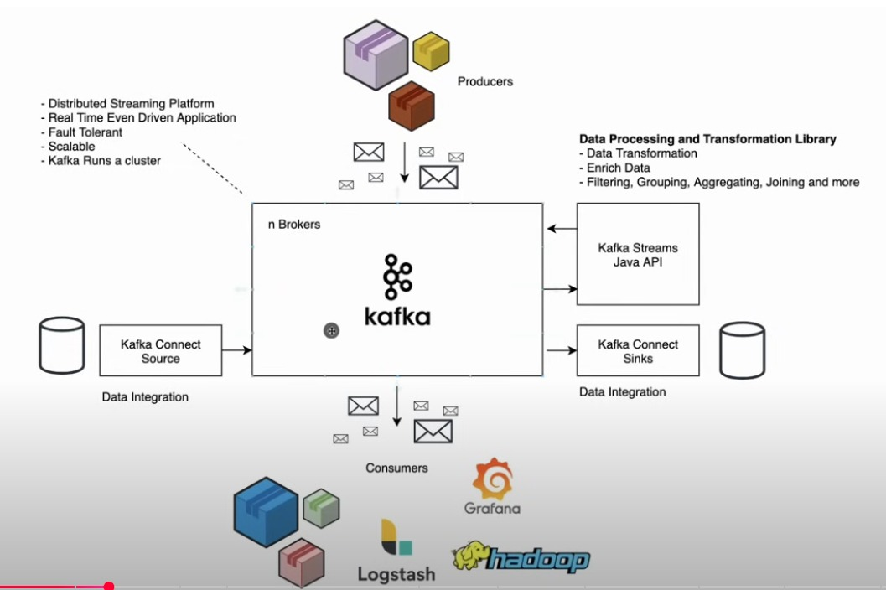

### https://kafka.apache.org/quickstart
### steps 1  : install zookeeper for kafka Broker environment cluster host
### Start Kafka server in mac run this in terminal : /opt/homebrew/opt/kafka/bin/kafka-server-start /opt/homebrew/etc/kafka/server.properties

### Kafka producer send the Topic(unique key) with msg(Data) -> Brokers(zookeeper) can be multiple servers -> Kafka Consumer Listen the Topic(unique key) from Producer and read the Data related to that Topic 
### After kafka 4.o version zookeeper no need, by default hv

